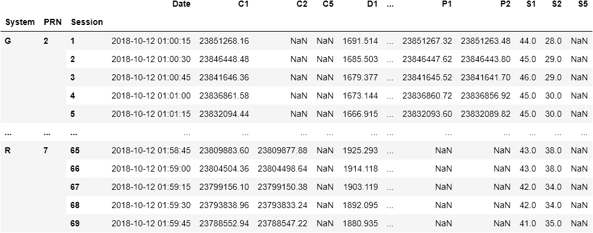
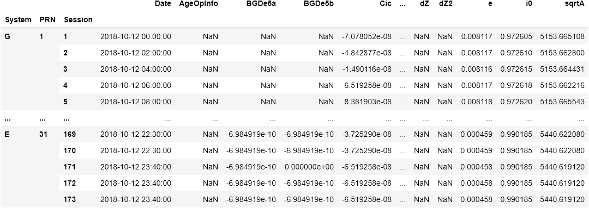
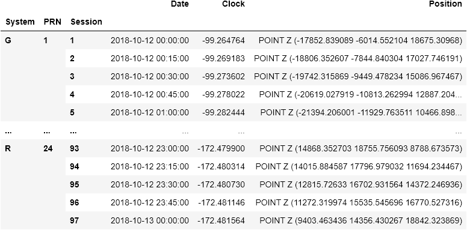

<p align="center">
  <a href="" rel="noopener">
 </a>
</p>

<div align="center">

[]()
[](/LICENSE)

</div>

---

<p align="center"> Process <code>RINEX</code>, <code>SP3</code> and other GNSS files for orbit computation and geo-localization. Retrieve precise satellites and receptors position in a few lines of code.
    <br> 
</p>

## Table of Contents

- [About](#about)
- [Documentation](#documentation)
- [Getting Started](#getting_started)
- [GNSS Time](#gnsstime)
- [Rinex](#rinex)
- [Satellites](#satellites)
- [Contributing](../CONTRIBUTING.md)
- [Authors](#authors)
- [Acknowledgments](#acknowledgement)

## About <a name = "about"></a>

### Overview

This project will help you in your GNSS workflow. It provides tools for manipulating / converting GNSS dates (from datetime to Julian Day), readers for ``RINEX`` and ``SP3`` for version 2 and 3. 
Last but not least, ``gnsstools`` lets you correct GNSS orbits from raw files, and compute receptors' position.

### Status

| Development                  | Status      | Feature                                                                |
| ---------------------------- | ----------- | ---------------------------------------------------------------------- |
| GNSS Time                    | finished    | <ul><li>[x] DateTime</li><li>[x] GPS Time</li><li>[x] Julian Day</li><li>[x] Modified Julian Day</li></ul> |
| Rinex                        | in progress | <ul><li>[x] Rinex Observation</li><li>[x] Rinex Navigation</li><li>[x] SP3</li><li>[ ] Rinex Compact</li></ul> |
| Satellites                   | in progress | <ul><li>[ ] Position</li><li>[ ] Clock Offset</li><li>[ ] Pseudo Distance</li></ul> |

## Documentation <a name = "documentation"></a>

### Read The Docs

The documentation is available online on [readthedocs](https://gnsstools.readthedocs.io/en/latest/). You will find the code documentation of the whole package, examples and tutorials. Make sure you have read the documentation before opening an issue.

### Tutorials

In addition of the examples and tutorials available on [readthedocs](https://gnsstools.readthedocs.io/en/latest/),
there is a list of [jupyter notebooks](notebooks). Each one focuses on a specific topic: [reading files](notebooks/),
[retrieving orbits](notebooks/), [computing receptor's position](notebooks) etc.

## Getting Started <a name = "getting_started"></a>

These instructions will show you the steps on how to install and use ``gnsstools`` straight from the box.

### Installing

The package is available from [PyPi](https://pypi.org/project/gnsstools/). To install it, use:

```
pip install gnsstools
```

Alternatively, you can install the latest version from this repository. [Download](https://github.com/arthurdjn/gnsstools/archive/main.zip) the package from github, then from the root folder:

```
python install .
```

## GNSS Time <a name = "gnsstime"></a>

To handles and convert time in different time system you should use the module ``gnsstime``. It will create a time in the ``datetime.datetime`` format, and also process the provided arguments.

### Usage

The ``gnsstime`` object behave exactly like a ``datetime`` one, as it inherits from it.

```python
from gnsstools import gnsstime

# Create a datetime from GNSS information
# Year, Month, Day, Hour, Minute, Second, MicroSecond
date = gnsstime(18, 1, 1, 0, 0, 0)
date = gnsstime(2018, 1, 1, 0, 0, 0)
```

However, the ``gnsstime`` is not type sensitive: you can provide arguments as a ``string``, ``float`` or ``int``.
If the argument is a string, it will convert it first as a float. Then, depending on the argument, it will extract the decimal and update the other arguments.  
For example, if ``second=5.35``, the number of seconds will be ``5`` and the number of microsecond ``350000``. Same for ``day=2.74`` etc.

```python
# Provide arguments as a string
date = gnsstime("18", "1", "1", "0", "0", "0")
date = gnsstime("2018", "01", "01", "00", "00", "00.000000")

# Provide argument as a float
date = gnsstime(2018, 1, 1, 5.933, 4.36, 33.231)
```

You can also retrieve the number of days of the year, seconds of the day / weeks etc:

```python
date = gnsstime(2018, 1, 1, 0, 0, 0)

doy = date.doy # Day of the year
woy = date.woy # Week of the year
sod = date.sod # Second of the day
sow = date.sow # Second of the week
```

### GPS Time

You can retrieve the number of seconds, days and weeks from a the GPS origin (*GPS0*) with:

```python
date = gnsstime(2018, 1, 1, 0, 0, 0)

# From GPS0 defined at 1980-01-06T00:00:00 (UTC)
seconds0 = date.seconds0
days0 = date.days0
weeks0 = date.weeks0
```

### Julian Day

You can also retrieved the Julian Day:

```python
date = gnsstime(2000, 1, 1, 0, 0, 0)

# Julian Day for year 2000
jd = date.jd
# Julian Day for year 1950
jd50 = date.jd50
```

You can also create a ``gnsstime`` object from a Julian Day:

```python
jd = 2451545.0
date = gnsstime.fromjd(jd)

jd50 = 2433282.5
date = gnsstime.fromjd50(jd)
```

### Modified Julian Day

Finally, you can extract modified Julian Day:

```python
date = gnsstime(2000, 1, 1, 0, 0, 0)

# Modified Julian Day
mjd = date.mjd
```

Again, you can create a ``gnsstime`` object from a modified Julian Day:

```python
mjd = 51544.5
date = gnsstime.frommjd(mjd)
```

## Rinex <a name="rinex"></a>

Load GNSS navigation and observation data as a ``pandas.DataFrame``.

The supported format are:
- ``.**o`` : Rinex 2 Observation,
- ``*O.rnx`` : Rinex 3 Observation,
- ``.**n``, ``.**g`` : Rinex 2 Navigation,
- ``*N.rnx`` : Rinex 3 Navigation,
- ``.SP3`` : SP3

### Observation

```python
from gnsstools import rinex

filename = "data/edf1285b.18o"
df = rinex.load(filename)
```



### Navigation

```python
from gnsstools import rinex

filename = "data/BRDC00IGS_R_20182850000_01D_MN.rnx"
df = rinex.load(filename)
```



### SP3

```python
from gnsstools import rinex

filename = "data/COM20225_15M.SP3"
df = rinex.load(filename)
```



### Compact

*Work in Progress*

## Satellites <a name = "satellites"></a>

*Work in Progress*

## Contributing <a name = "contributing"></a>

## Authors <a name = "authors"></a>

## Acknowledgements <a name = "acknowledgement"></a>

- Hat tip to anyone whose code was used
- Inspiration
- References
